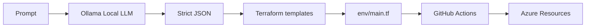

# Azure AI Terraform — Prompt → Terraform → GitHub Actions (Azure)

Generate Azure infrastructure from **plain-English prompts** using a **local LLM (Ollama)**, then deploy with **Terraform** via **GitHub Actions**.

**Recruiter summary (what this demonstrates):**
- Local AI-assisted automation (prompt → structured JSON)
- Infrastructure as Code (Terraform templating)
- CI/CD to Azure (GitHub Actions)
- Security hygiene (no secrets committed, least-privilege guidance)

---

## How it works

1) You type a command (prompt)
2) Local LLM (Ollama) converts it into strict JSON
3) JSON fills Terraform templates → writes `env/main.tf`
4) Terraform runs locally: `fmt` → `init` → `validate`
5) Git commit/push → GitHub Actions runs `terraform plan/apply`



---

## Quick demo

Run locally:

```bash
python local_ai.py
```

Example prompts:

- `create storage account rg_name=dev-rg location="Central India" storage_account_name=aistorage1234`
- `create vm rg_name=dev-rg location="Central India" vm_name=ai-vm vm_size=Standard_B1s`

---

## Repo structure

```
azure-ai-terraform/
├── .github/workflows/terraform.yml
├── env/
│   ├── provider.tf
│   └── main.tf          # generated
├── templates/
│   ├── storage.tf.tpl
│   └── vm.tf.tpl
├── local_ai.py
├── .gitignore
└── README.md
```

---

## Prerequisites

- Terraform
- Git
- Python 3.10+
- Ollama
- Azure CLI

---

## Setup (local)

### 1) Start Ollama + pull a model

```bash
ollama pull phi3:mini
curl http://127.0.0.1:11434/api/tags
```

### 2) Prepare Terraform working folder

This repo generates `env/main.tf`.

---

## Setup (GitHub Actions → Azure)

This workflow uses **Service Principal** auth via repository secrets.

Create an SP (example):

```bash
az login
az ad sp create-for-rbac \
	--name "github-terraform-sp" \
	--role Contributor \
	--scopes /subscriptions/<SUBSCRIPTION_ID>
```

Add repo secrets:

- `ARM_CLIENT_ID`
- `ARM_CLIENT_SECRET`
- `ARM_SUBSCRIPTION_ID`
- `ARM_TENANT_ID`

---

## Security notes

- Do not commit keys, SSH material, kubeconfig, or tfstate.
- This repo ignores `.terraform/`, `*.tfstate*`, and `*.pem/*.pub`.

---

## Extending the project

Add a new action by:

1) Creating a new template in `templates/`
2) Adding it to `TEMPLATES` in `local_ai.py`
3) Extending the JSON schema in `call_llm_json()`

